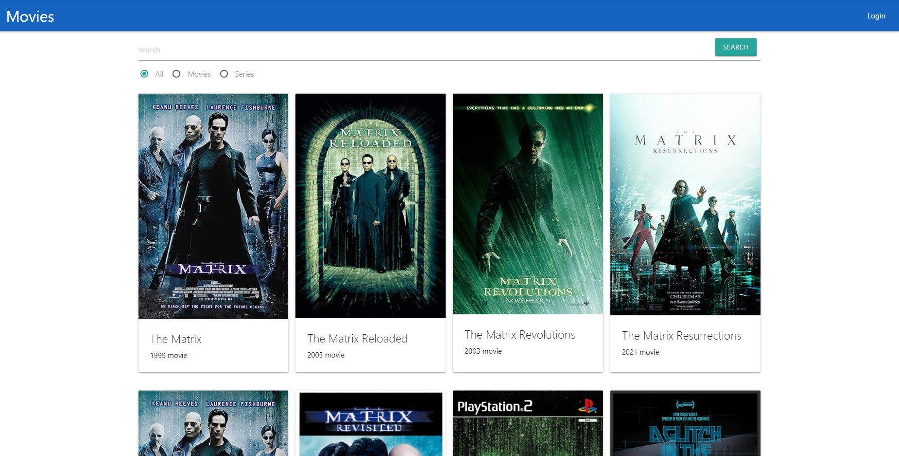
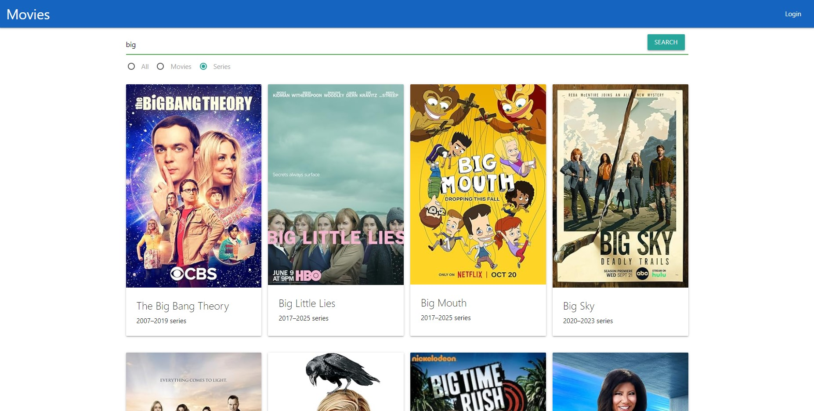
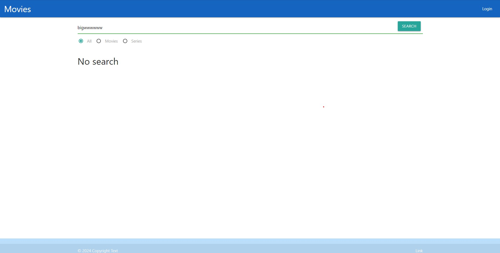

<h1 align="center">React Movie Project</h1>
Этот проект представляет собой SPA на React, которое позволяет пользователям просматривать названия фильмов с обложками. Приложение использует API https://www.omdbapi.com/ для получения списка файлов и предоставляет простой интерфейс. Реализован поиск фильмов по названию. 

<h2 align="center">Установка</h2>

1. **Клонируйте репозиторий:**
    ```bash
    git clone https://github.com/NikitaTichonow/movie-react-app

2. **Перейдите в папку проекта:**
    ```bash
    cd movie-react-app

3. **Установите виртуальное окружение и активируйте его:**
     ```bash
    npm i    

4. **Установите необходимые зависимости:**
     ```bash
     pip install -r requirements.txt
   
5. **Откройте файл .env.local и заполнить его своими данными**
   ```env
    REACT_APP_API_KEY = ........

6. **Запустите сервер разработки:**
    ```bash
    npm start
    
7. **Доступ к приложению:**
   
    После завершения всех вышеуказанных шагов, приложение будет доступно по адресу http://localhost:3000/

<p align="center">
  
  
  
</p>
